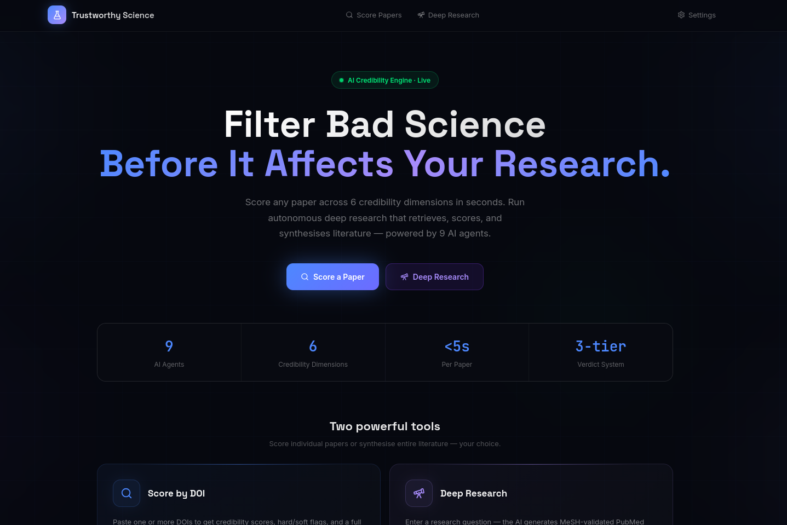

# Trustworthy Science

An AI-powered credibility filter for scientific literature. A LangGraph multi-agent pipeline that scores papers on a **Trust Score (0–100)** and assigns a tier (`Trusted` / `Caution` / `Untrusted`). A FastAPI backend exposes the pipeline as a REST API consumed by a React + Vite frontend.

---


---

## Features

- **Trust Score (0–100)** with tier classification (`Trusted` / `Caution` / `Untrusted`)
- **Paper Type Classification** — detects 8 paper types (RCT, systematic review, meta-analysis, case report, opinion, theoretical, computational, empirical) and applies type-appropriate checks
- **Type-aware Reproducibility Checks** — narrative reviews and theoretical papers are never penalized for missing data/code; clinical trials are checked for preregistration but not code availability
- **Statistical Integrity** — p-curve analysis to detect p-hacking; flags missing effect sizes and underpowered samples (skipped for non-empirical types)
- **Hard / Soft Flags and Quality Signals** — retraction detection, predatory venue check, self-citation ratio, open data/code detection, preregistration detection
- **LLM Structured Reports** — per-paper verdict with score breakdown, key concerns, positive signals, and recommendation generated by the scoring agent
- **Configurable Scoring** — all weights and thresholds live in `config/scoring.yaml`; no code change needed to tune behavior
- **Multiple Inputs** — score by DOI or PMID, or retrieve papers from PubMed / bioRxiv / Crossref via a natural-language query
- **Deep Research Mode** — autonomous literature synthesis: LLM generates MeSH-validated PubMed queries, scores all retrieved papers, ingests accepted papers into ChromaDB, and produces a cited literature review
- **MeSH Query API** — standalone endpoint to validate medical terms against the NCBI MeSH database and build Boolean PubMed queries
- **RAG Integration** — `filter_for_rag()` returns only papers above a minimum credibility tier

---

## Architecture

### LangGraph Agent Graphs

The credibility pipeline is built with LangGraph as two nested graphs.

#### Per-paper sub-graph (`graph.py → _make_paper_graph`)

```
START
  └─► fetch_parse
          └─► retraction_watch
                  ├─(retracted)──────────────────────────────► scoring ─► END
                  └─(not retracted)─► paper_classifier
                                              └─► stats_integrity
                                                      ├─► reproducibility ──┐
                                                      ├─► citation_network ─┤─► scoring ─► END
                                                      ├─► methodology ──────┤
                                                      └─► publication_metadata ─┘
```

`reproducibility`, `citation_network`, `methodology`, and `publication_metadata` run concurrently. LangGraph merges their writes via `Annotated` reducer annotations on `PaperState`.

#### Multi-paper outer graph (`graph.py → _make_multi_graph`)

```
START ─► retrieve ─► score_papers ─► filter ─► END
```

`retrieve` fans out to PubMed / bioRxiv / Crossref. `score_papers` runs the per-paper sub-graph for each stub. `filter` applies `min_tier` and sorts results.

#### Deep Research graph (`graph.py → _make_deep_research_graph`)

```
START ─► query_generator ─► parallel_pubmed_fetch ─► score_all ─► rag_ingest ─► END
```

| Phase | Node | Description |
|-------|------|-------------|
| 1 | `query_generator` | Two-phase MeSH Librarian agent: extracts PICO concepts from the user prompt, validates each against NCBI MeSH, then constructs 3–5 diverse Boolean PubMed queries |
| 2 | `parallel_pubmed_fetch` | Fetches PaperStubs for every generated query, deduplicates, caps at `max_papers` |
| 3 | `score_all` | Runs each stub through the per-paper sub-graph; sorts by score |
| 4 | `rag_ingest` | Filters by `min_tier`, ingests accepted papers into ChromaDB, generates a cited literature review |

---

### Scoring Agents

All state flows through `PaperState` (defined in `state.py`).

| Agent | Node key | What it does |
|-------|----------|-------------|
| `fetch_and_parse` | `fetch_parse` | Fetches full text via BioC JSON / PMC / PDF / bioRxiv; falls back to abstract |
| `retraction_watch_agent` | `retraction_watch` | Checks Retraction Watch database; sets `RETRACTED` hard flag and short-circuits |
| `classify_paper_type` | `paper_classifier` | Assigns one of 8 paper types from title + abstract using regex rules |
| `stats_integrity_agent` | `stats_integrity` | Extracts p-values; runs p-curve analysis; flags `P_HACKING_CLUSTER`, `MISSING_EFFECT_SIZES`, `SMALL_SAMPLE_UNDERPOWERED` |
| `reproducibility_agent` | `reproducibility` | Checks for open data, open code, preregistration; respects type-applicability matrix |
| `citation_network_agent` | `citation_network` | Calculates self-citation ratio and citation diversity via OpenAlex |
| `methodology_agent` | `methodology` | LLM-based methods quality assessment; produces a 0–1 score and free-text rationale |
| `publication_metadata_agent` | `publication_metadata` | Checks DOAJ membership, Beall's predatory-publisher list, venue impact; COI / funding analysis |
| `scoring_agent` | `scoring` | Fuses all sub-scores and flags into a composite score and tier; generates LLM structured report |

---

### Scoring Formula

```
score = base(70) − Σ soft_penalties + Σ quality_bonuses (capped at 20) + methods_nudge (±15%)
if any hard_flag → score ≤ 25 → Untrusted
Trusted ≥ 70 | Caution ≥ 45 | Untrusted < 45
```

**Hard flags** (cap score at ≤ 25): `RETRACTED`, `P_HACKING_CLUSTER`, `PREDATORY_VENUE`, `OUTCOME_SWITCHING_CONFIRMED`, `IMAGE_MANIPULATION`

**Soft penalties** (configurable): `NO_DATA_DEPOSIT` (−8), `NO_CODE_AVAILABILITY` (−5), `HIGH_SELF_CITATION` (−7), `MISSING_EFFECT_SIZES` (−6), `METHODS_INCOMPLETE` (−8), and more.

**Quality bonuses** (configurable, capped at +20): `PREREGISTERED` (+6), `OPEN_DATA` (+6), `OPEN_CODE` (+4), `INDEPENDENTLY_REPLICATED` (+10), and more.

All weights are in `config/scoring.yaml`.

---

### Paper Type Classification

`paper_classifier.py` identifies 8 paper types from title + abstract using regex rules:

| Type | Example |
|------|---------|
| `empirical_quantitative` | original research study (default) |
| `clinical_trial` | RCT, phase I–IV trial |
| `systematic_review_meta` | systematic review, meta-analysis, PRISMA |
| `review_narrative` | literature review, scoping review |
| `theoretical` | mathematical model, formal proof |
| `computational_methods` | software tool, pipeline, algorithm |
| `case_report` | case report, case series |
| `opinion_commentary` | editorial, perspective, commentary |

Type-applicability matrix in `config/scoring.yaml`:

```yaml
paper_type_applicability:
  empirical_quantitative:   {data: true,  code: true,  prereg: true}
  clinical_trial:           {data: true,  code: false, prereg: true}
  systematic_review_meta:   {data: true,  code: false, prereg: false}
  review_narrative:         {data: false, code: false, prereg: false}
  theoretical:              {data: false, code: false, prereg: false}
  computational_methods:    {data: false, code: true,  prereg: false}
  case_report:              {data: false, code: false, prereg: false}
  opinion_commentary:       {data: false, code: false, prereg: false}
```

Criteria set to `false` are silently skipped — no penalty, no flag.

---

### LLM Structured Reports

The `scoring_agent` calls an LLM to produce a five-section structured report for every paper:

- **OVERALL VERDICT** — one-sentence summary with score and tier
- **SCORE BREAKDOWN** — per-dimension table (dimension | score % | rationale)
- **KEY CONCERNS** — hard and soft flags in plain English
- **POSITIVE SIGNALS** — quality bonuses with explanations
- **RECOMMENDATION** — cite with caution / safely include / exclude

Falls back to a deterministic report if the LLM is unavailable.

---

### MeSH Query Validation

The Deep Research librarian agent uses a two-phase pipeline:

1. **Phase 1 — Concept Extraction**: LLM extracts PICO elements (Population, Intervention, Comparison, Outcome) from the user prompt as a JSON list of medical concepts.
2. **Phase 2 — Query Construction**: Each concept is validated against NCBI MeSH via `batch_mesh_lookup`; the LLM then constructs 3–5 diverse Boolean PubMed queries using `[Mesh]` tags for validated terms and `[Title/Abstract]` for unvalidated ones.

Results are cached in SQLite to avoid redundant NCBI calls.

---

## FastAPI Backend

Entry point: `trustworthy_science.server.app` — runs on port **8001** (development) / **8000** (Docker / production).

### Endpoints

| Method | Path | Description |
|--------|------|-------------|
| `POST` | `/score` | Score papers by DOI, PMID, or query (synchronous; small batches) |
| `POST` | `/explain` | Full per-dimension credibility breakdown for a single paper |
| `POST` | `/filter` | Retrieve and filter papers for a query; returns only papers ≥ `min_tier` |
| `POST` | `/api/search` | Start a background scoring job; returns `job_id` |
| `GET`  | `/api/search/status/{job_id}` | Poll status and results of a scoring job |
| `POST` | `/api/deep-research` | Start a background Deep Research pipeline job |
| `GET`  | `/api/deep-research/status/{job_id}` | Poll status and results (phases + literature review) |
| `POST` | `/api/deep-research/chat` | Chat with the generated ChromaDB collection (session-aware) |
| `GET`  | `/api/mesh/lookup` | Validate a single keyword against NCBI MeSH |
| `POST` | `/api/mesh/batch-lookup` | Validate up to 20 keywords against NCBI MeSH |
| `GET`  | `/admin/...` | Admin utilities (cache flush, config reload) |
| `GET`  | `/health` | Health check |
| `GET`  | `/docs` | Interactive Swagger UI |

All scoring endpoints accept an optional `weights` object to override `config/scoring.yaml` at request time without a server restart.

### Running the backend

```bash
# Development (port 8001, auto-reload)
uv run trustworthy-science-server

# Or directly with uvicorn
uvicorn trustworthy_science.server.app:app --host 0.0.0.0 --port 8001 --reload
```

---

## React + Vite Frontend

Located in `frontend/`. Built with **React 18**, **TypeScript**, **Vite 6**, **Tailwind CSS v4**, and **shadcn/ui** (Radix UI primitives).

### Pages

| Route | Page | Description |
|-------|------|-------------|
| `/` | Landing | Hero page with feature overview |
| `/doi` | DOI Search | Score one or more papers by DOI or PMID |
| `/query` | Query Search | Natural-language search; background scoring job with live progress |
| `/paper/:id` | Paper Detail | Full structured report, dimension bars, flags, quality signals |
| `/review` | Paper Review | Side-by-side paper comparison and review |
| `/deep-research` | Deep Research | Autonomous literature synthesis with MeSH query display and literature review viewer |
| `/literature-review` | Literature Review | Browse and export generated literature reviews |
| `/rag` | RAG Comparison | Compare RAG context windows before/after credibility filtering |
| `/settings` | Settings | Scoring weight customizer with live preview |

### Key components

- **`ScoreRing`** — animated circular score indicator with tier colour
- **`DimensionBars`** — per-dimension sub-score visualisation
- **`TierBadge`** — `Trusted` / `Caution` / `Untrusted` pill badge
- **`JobStatusTracker`** — live progress tracker for background scoring jobs
- **`ScoringWeightCustomizer`** — slider UI to override scoring weights per request
- **`StructuredReportDisplay`** — renders the five-section LLM structured report
- **`LiteratureReviewViewer`** — displays the generated literature review with inline citations
- **`GraphViz`** — citation graph visualisation (react-force-graph-2d)

### Running the frontend

```bash
cd frontend
npm install          # or: npm ci
npm run dev          # dev server at http://localhost:5173
npm run build        # production build → dist/
```

Set the backend URL in `frontend/.env.production`:

```
VITE_API_BASE_URL=http://your-server-ip
```

---

## Installation

Requires Python 3.12+ and [`uv`](https://github.com/astral-sh/uv).

```bash
git clone https://github.com/your-username/trustworthy-science.git
cd trustworthy-science
uv pip install -e .
```

### Environment variables

```bash
# .env or shell exports
K2_API_KEY="your-key-here"        # Required: LLM API key (K2-Think-v2)
NCBI_API_KEY="your-ncbi-key"      # Optional: raises NCBI rate limit to 10 req/s
NCBI_EMAIL="you@example.com"      # Optional: identifies your NCBI requests
CORS_ORIGINS="https://your-domain.com"  # Optional: comma-separated allowed origins
```

---

## CLI Usage

### Score papers

```bash
# By DOI
trustworthy-science score --doi 10.1038/s41586-020-2748-1

# Multiple DOIs
trustworthy-science score --doi 10.1038/s41586-020-2748-1 --doi 10.1126/science.1127349

# By search query
trustworthy-science score --query "GLP-1 receptor agonists in NASH" --top-k 5

# JSON output
trustworthy-science score --query "CRISPR off-target effects" --output json
```

### Filter for RAG

```bash
trustworthy-science filter \
    --query "Impact of social media on adolescent mental health" \
    --top-k 20 \
    --min-tier Caution
```

### Explain a single paper

```bash
trustworthy-science explain --doi 10.1038/s41586-020-2748-1
```

Shows the full credibility report: score, tier, structured LLM report, all hard/soft flags, and quality signals.

### Global options

```bash
trustworthy-science --config config/scoring.yaml --log-level INFO score --doi 10.xxx/xxx
trustworthy-science -v score --doi 10.xxx/xxx   # verbose agent logs
```

---

## Python API

```python
from trustworthy_science.api import TruthFilter

tf = TruthFilter.from_config()          # uses config/scoring.yaml by default

# Score a list of DOIs
reports = tf.score_papers(dois=["10.1038/s41586-020-2748-1"])

# Score by query
reports = tf.score_papers(query="CRISPR gene editing", top_k=10)

# Filter for RAG — returns only papers at or above min_tier
filtered = tf.filter_for_rag(
    query="CRISPR gene editing for cystic fibrosis",
    top_k=20,
    min_tier="Caution",
)

# Single paper with full explanation
result = tf.score_single("10.1038/s41586-020-2748-1")
```

---

## Configuration

`config/scoring.yaml` controls all pipeline behavior:

- **`scoring`** — base score, methods nudge weight, quality bonus cap
- **`soft_flags`** — penalty per flag code
- **`quality_signals`** — bonus per signal code
- **`tiers`** — score thresholds and hard-flag cap
- **`pcurve`** — p-hacking detection thresholds
- **`paper_type_applicability`** — per-type check matrix
- **`reproducibility`** — regex patterns for data/code/preregistration detection
- **`citation_network`** — self-citation and diversity thresholds
- **`rag`** — `max_papers_per_session` cap for Deep Research

---

## Deployment

### Docker (backend)

```bash
docker build -t trustworthy-science .
docker run -d \
  -p 8000:8000 \
  -e K2_API_KEY=your-key \
  trustworthy-science
```

The Dockerfile builds the FastAPI + uvicorn backend. Frontend static files are served separately by nginx.

### Production (Ubuntu / DigitalOcean)

The `deploy/` directory contains a fully automated setup:

```
deploy/
├── setup.sh                      # One-shot server provisioning script
├── nginx.conf                    # Reverse proxy + static file config
└── trustworthy-science.service   # systemd unit for the uvicorn backend
```

**One-time setup on a fresh Ubuntu 22.04 droplet:**

```bash
# Clone the repo to /var/www/trustworthy-science, then:
bash /var/www/trustworthy-science/deploy/setup.sh YOUR_SERVER_IP
```

The script installs system dependencies, `uv`, Python packages, builds the frontend, installs the systemd service, configures nginx, and sets up UFW.

**After setup:**

```bash
# Create the .env file
nano /var/www/trustworthy-science/.env
# Add: K2_API_KEY=your_key_here

# Start the backend service
systemctl start trustworthy-science
systemctl status trustworthy-science

# Verify
curl http://YOUR_SERVER_IP/health
```

**nginx** serves the Vite production build (`frontend/dist/`) as a React SPA with client-side routing, and proxies all `/score`, `/filter`, `/api`, `/health`, `/docs`, and `/openapi` requests to uvicorn on `127.0.0.1:8000`. Static assets are cached for 1 year (Vite adds content hashes to filenames).

---

## Running Tests

```bash
# All tests
pytest tests/

# Verbose output
pytest tests/ -v

# Single file
pytest tests/test_paper_type_aware_scoring.py -v

# Single test
pytest tests/test_scoring.py::test_function_name -v
```

Tests are fully mocked (no live API calls). `pytest-asyncio` is used for async agent tests.

---

## What's Next?

**Visual Analysis**: Implement multi-modal agents to analyze figures and charts for signs of image manipulation.

**Granular Stats**: Add deep-dive statistical agents to perform GRIM (Granularity-Related Inconsistency Check) tests on reported means and SDs.

**Broadened Scope**: Expand beyond biomedical research into social sciences and engineering by integrating ArXiv and SSRN.
